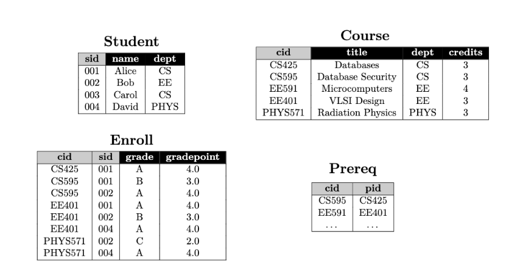
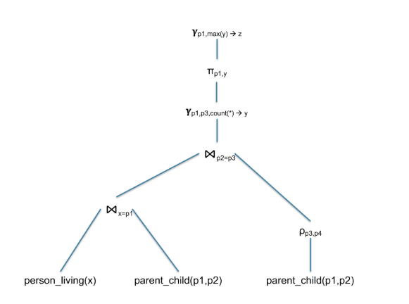

Question 1 
Question 1.1 
Write a relational algebra expression that returns the titles of all the courses with more than 3 credits from the EE department. 

Question 1.2 
Write a relational algebra expression that returns for each student the title of courses they have taken from their major, i.e., where the course’s dept is equal to the student’s dept.

Question 1.3
Write a relational algebra expression that returns the title and dept of courses that do not have any prerequisites.

Write a relational algebra expression that returns the titles of courses that have more than one prerequisite.

Question 1.4
Write a relational algebra expression that returns for each student the number of failed credits. The failed credits for a student is the number of credits of courses they have taken and have scored a gradepoint of less than 2.0.

Question 1.5
Write a relational algebra expression that returns for the two students with sid 001 and 002 the cid of courses that only one of them has taken.

Question 2
Question 2.1 
Write the equivalent SQL query to the following relational algebra query plan:

Question 2.2 
Write a relational algebra plan for the following SQL query:

SELECT a.p
FROM   person_living AS a, male AS b
WHERE  a.p = b.name AND
       NOT EXISTS (SELECT *
                   FROM   parent_child AS c, female AS d
                   WHERE  c.p1=d.name AND c.p2=a.p)