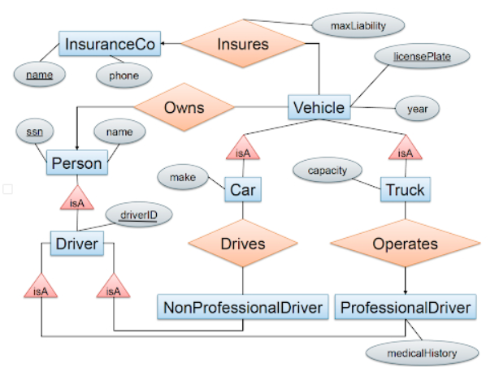

**Question 1**

Design an E/R diagram for geography that contains the following kinds of objects or entities together with the listed attributes.
Model the relationships between the objects with edges. Note that edges between entities can be labeled with constraints. Make sure to label only the/those primary key(s) that is/are mentioned below.

*Entities*
- countries (with attributes): name, area, population, gdp ("gross domestic product")
    a country's name uniquely identifies the country within all countries

- cities: name, population, longitude, latitude
    a city is uniquely identified by its (longitude, latitude) (not by name, ex:there are 41 different cities and towns named Springfield in the US!)

- rivers: name, length

- seas: name, max depth
    rivers and seas are uniquely identified within all water entities by their name (e.g., "Ganges" would be a unique water entity)

*Relationships:*
- each city belongs to exactly one country

- each river crosses at least one country

- each country can be crossed by zero or more rivers

- each river ends in either a river or a sea 

You can draw your diagrams on paper and scan them, take quality pictures of your drawn diagram, or use your favorite drawing tool such as Powerpoint, Keynote, or draw.io. (FYI: Google Slides lacks a few shapes that you might need such as rounded arrows... You can use a crescent and a line)

**Question 2**

Consider the following E/R diagram:

License plate can have both letters and numbers; driverID and Social Security contain only numbers; maxLiability is a real number; year, phone, capacity are integers; everything else are strings.

- Translate the diagram above by writing the SQL CREATE TABLE statements to represent this E/R diagram. Include all key constraints; you should specify both primary and foreign keys. Make sure that your statements are syntactically correct (you might want to check them using sqlite / Azure for instance).

- Which relation in your relational schema represents the relationship "insures" in the E/R diagram and why is that your representation?

- Compare the representation of the relationships "drives" and "operates" in your schema, and explain why they are different.

**Question 3**
Consider the following two relational schemas and sets of functional dependencies:

- R(A,B,C,D,E) with functional dependencies D → B, CE → A.

- S(A,B,C,D,E) with functional dependencies A → E, BC → A, DE → B.

For each of the above schemas, decompose it into BCNF. Show all of your work and explain, at each step, which dependency violations you are correcting. Make sure you describe each step in your decomposition steps. For each step, you can describe what you have done in that step. Eg: whether the current schema violates BCNF or what you did to remove that violation, etc. (10 points each)

**Question 4** 
A set of attributes X is called closed (with respect to a given set of functional dependencies) if X+=X. Consider a relation with schema R(A,B,C,D) and an unknown set of functional dependencies. For each closed attribute set below, give a set of functional dependencies that is consistent with it.

- All sets of attributes are closed.

- The only closed sets are {} and {A,B,C,D}.

- The only closed sets are {}, {A,B}, and {A,B,C,D}. 